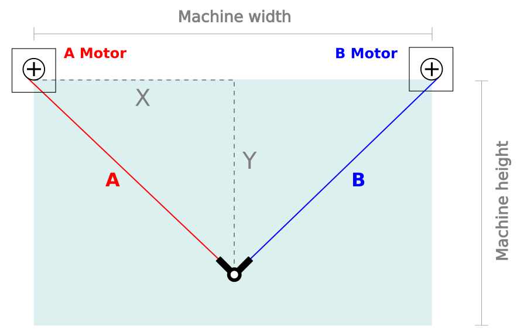
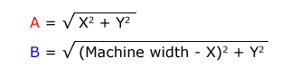
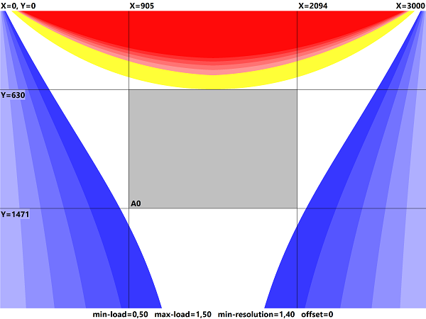
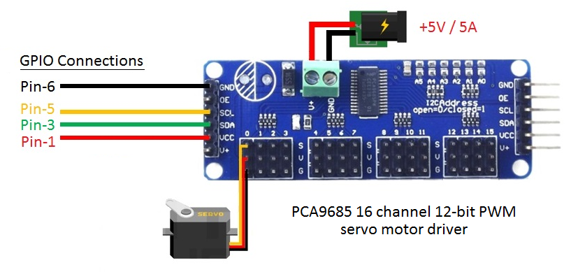

# vPlot

vPlot è una stampante verticale, un tipo di stampante che disegna tracciati e figure su una superfice verticale utilizzando due motori e la forza di gravità.

## Requisiti

vPlot utilizza i seguenti componenti:

>- 1x Raspberry Pi 3 Model B board
>- 1x PCA9685 16 channel 12-bit PWM servo motor driver board
>- 1x CNC Shield V3 expansion board
>- 2x DRV8825 stepper motor driver 
>- 2x Stepper motor Nema-17 (min torque 40Ncm)
>- 1x Micro digital servo 
>- 2x Timing belt pulley GT2 20T 5mmn bore
>- 2x Smooth idler pulley with bearings GT2 20T 5mm bore
>- 2x 2,5m GT2 timming belt 
>- 1x 12V/5A power supplier
>- 1x 5V/5A power supplier 
>- 1x Pen holder (buy or print at home with a 3D printer)
>- 2x Motor supports (buy or print at home with a 3D printer)

Per compilare vPlot-Driver e vPlot-Layout occorre installare sulla scheda Raspberry Pi:  

>- [WiringPi library](http://wiringpi.com/download-and-install/)
>- [Lazarus IDE and FreePascal compiler](https://www.lazarus-ide.org/index.php?page=downloads)

## Working principle

Ogni posizione XY del pennino è definita da una coppia di lunghezze A e B.

Per ciascuna posizione del pennino è possibile calcolare tali lunghezze utilizzando il teorema di pitagora:

Per semplicità costruttiva, solitamente i due motori vengono posizionati alla stessa altezza da terra.

## Working area:

vPlot-Layout permette di calcolare l'area di stampa ottimale in base alla

>- distanza tra i due motori

ed ai seguneti parametri:

>- min rapporto tra tensione cinghia e massa supporto pennino
(default 0.5)
>- max rapporto tra tensione cinghia e massa supporto pennino
(default 1.5)
>- max rapporto tra spostamento pennino ed allungamento cinghia
(default 1.4)

Nella zona in bianco vengono rispettati tutti e tre i parametri sopra indicati. Nella zona il blu il carico di una delle due cinghie è inferiore al carico minimo ammesso; Nella zona in rosso la tensione di una delle due cinghie è superiore carico massimo ammesso; Nella zona in giallo la risoluzione del plotter è inferiore alla risoluzione minima ammessa. 

In genere, più è grande la distanza tra i due motori più grande è l'area della zona bianca. 

## Before assembling

Next we need to set the maximum current on DRV8825

## Connecting to Raspberry

PCA9685 wiring:

 

CNC Shield wiring:

Nema 17 motors have 200 steps for rotation but by enabling quarters of steps on the Pololu drivers we can obtain up to 800 steps for rotation which allows for much more precision. For doing that add an

 

